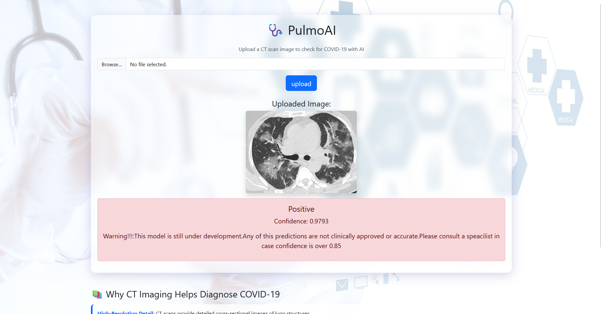

# PulmoAI 🫁  
**A COVID-19 Diagnosis Predictor Using CT Scan Images**

---

##  Research Background  
The COVID-19 pandemic has demanded rapid and reliable diagnostic tools. While RT-PCR remains the clinical gold standard, CT imaging has proved highly valuable for early detection and assessing disease severity. Leveraging advances in deep learning—particularly convolutional neural networks (CNNs)—PulmoAI aims to automate the detection of COVID-19 from CT scans to support fast clinical decision-making.

---

##  Datasets  
PulmoAI utilizes two publicly available CT scan datasets from Kaggle:

1. **COVID-19 Lung CT Scans** by Luis Blanche (_COVIDCT_)  
   - Provides labeled CT images of lungs affected by COVID-19 and healthy cases.  
   - [Kaggle: COVID-19 Lung CT Scans](https://www.kaggle.com/datasets/luisblanche/covidct)

2. **SARS-COV-2 Ct-Scan Dataset** by Plamen Eduardo  
   - Contains COVID-19 positive and negative CT scan images.  
   - [Kaggle: SARS-COV-2 Ct-Scan Dataset](https://www.kaggle.com/datasets/plameneduardo/sarscov2-ctscan-dataset)

Both datasets were combined, balanced, and preprocessed (resizing to **224 × 224 pixels**) to ensure consistency across samples.

---

##  Methodology

### 1. **Data Labeling**  
- Annotated CT scan images into COVID-positive and COVID-negative classes based on dataset metadata.

### 2. **Preprocessing**  
- Resized images to **224×224** pixels.  
- Applied normalization and optional data augmentations (e.g., rotation, flip, zoom).  
- Divided data into training, validation, and test sets for robust evaluation.

### 3. **Neural Network (PyTorch)**  
- Built a CNN in **PyTorch** with layers including convolution, ReLU, pooling, dropout, and fully connected layers.  
- Used **CrossEntropyLoss** and the **Adam optimizer**.  
- Monitored model accuracy, achieving a final test accuracy of **0.901**.

### 4. **Application (Flask)**  
- Deployed the trained model via a **Flask** web application.  
- Enables users to upload CT scans and receive instant predictions with confidence scores.

---
## UI Preview
### Homepage


### Prediction Result

---

##  Future Developments  
- Expand to a multi-class model (e.g., COVID-19 vs. pneumonia vs. healthy).  
- Integrate Explainable AI (XAI) tools like Grad-CAM for interpretability.  
- Build RESTful APIs and cloud deployment.  
- Explore deployment to mobile or edge devices for broader access.

---

##  Installation & Usage

```bash
git clone https://github.com/yourusername/pulmoai.git
cd pulmoai
pip install -r requirements.txt
python app.py
